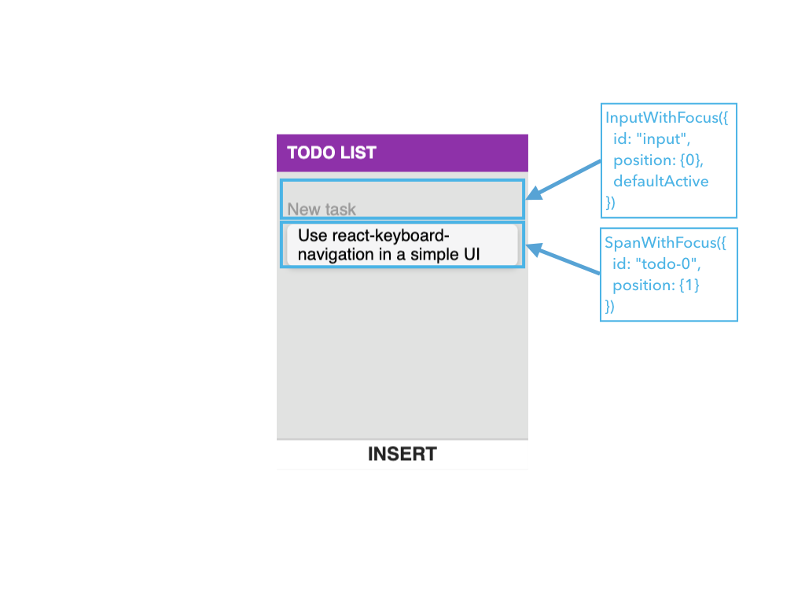
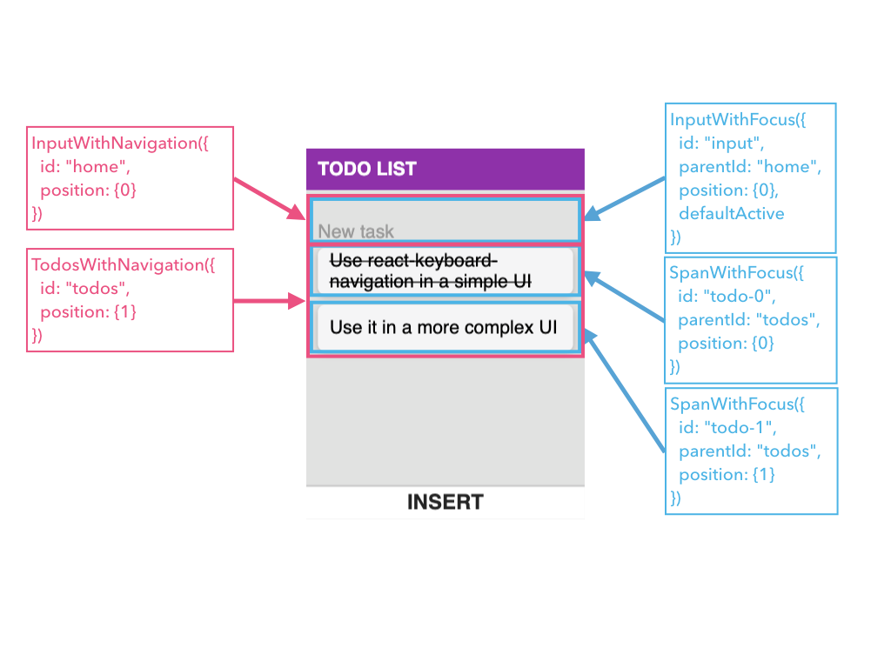

# Welcome to react-keyboard-navigation 👋

[](https://opensource.org/licenses/MIT)

> A React component to manage the navigation declaratively, such as on smart feature phone applications, e.g., KaiOS.

### 🏠 [Homepage](https://github.com/Orange-OpenSource/react-keyboard-navigation)

Navigation is the key "battlefield" when developing a non-touch mobile application, as on KaiOS smart feature phones.<br>
The preferred method of app navigation for the user is to interact with the D-pad. In this context, it is necessary to identify the navigation elements (clickable elements), to make every element focusable (tabIndex="0"), to handle the keydown or keyup event and to apply the focus to the desired DOM element (element.focus()).

Proposals to tag all navigation items with a particular CSS class, then browse the complete DOM for each event (up or down) and set the focus on the next or previous focusable DOM element exist.<br>
These solutions are simple and sufficient in some cases, but they have weak points:
* Browse the entire DOM every time is expensive and inefficient.
* The order of elements in the DOM does not always reflect the position in the UI.
* It is impossible to impose an order between the focusable elements.
* It is difficult to manage the case of modal windows.
* And finally, they are not virtual DOM friendly… and I love React 😋

react-keyboard-navigation is a [React](https://reactjs.org/) component that helps to manage the navigation using a declarative and component-based approach.<br>
It is based on the HOC (Higher Order Component) pattern: principle of composition, with a wrapper that simply add the functionality to the wrapped component.<br>
It is a very lightweight JavaScript library without dependencies : only 6.1 KB (.js) and 2.6 KB for the minified version (.min.js).  

## Install

react-keyboard-navigation is available in several builds:
* as CommonJS which is the primary way it will be used when installed via `npm`
* as ES modules (ECMAScript Modules) which is the way it will be used with module bundlers like [Webpack](https://webpack.js.org/) or [Rollup](http://rollupjs.org/) with `import` and `export` statements.
* as UMD (Universal Module Definition) for the use via a global variable by dropping it into a `<script>` tag.

### Install via npm
```sh
yarn add react-keyboard-navigation (or npm install react-keyboard-navigation)
```
### Add a script tag
You can also include it directly in your `index.html` like below:
```html
<script src="unpkg.com/react-keyboard-navigation/umd/react-keyboard-navigation.min.js"></script>
```
The exposed global variable name is ReactKeyboardNavigation.

## Usage
At the root of your application, add the navigation context thanks to the NavigationProvider wrapper component like this:
```js
import React from 'react';
import ReactDOM from 'react-dom';
import App from './App';
import { NavigationProvider } from 'react-keyboard-navigation';

ReactDOM.render(<NavigationProvider><App /></NavigationProvider>, document.getElementById("root"));
```

Now you can use the 2 HOCs (Higher Order Components) included in react-keyboard-navigation:
* `withFocus` to wrap an HTML element (required to use element.focus()) and transform it in a focusable element.
* `withNavigation` to wrap a React component or an HTML element and transform it in a container.

The use of `withNavigation` is optional, it allows to organize the interface more easily, for example with a header, a content and a footer.<br>
It also allows to define a modal window.

### withFocus
```js
import { withFocus } from 'react-keyboard-navigation';

const InputWithFocus = withFocus(
  ({ forwardedRef, ...props }) => <input ref={forwardedRef} {...props} />
);

const App = () => (
  <InputWithFocus id="input" position={0} defaultActive />
);
```
#### withFocus properties
* `id`: PropTypes.string.isRequired<br>
A unique identifier (inside a container).
* `parentId`: PropTypes.string<br>
The id of the container, parent of the element. Default to 'default'.
* `position`: PropTypes.number<br>
The position (order) of the element in the UI. If not specified, take the order of the mounting in the DOM (componentDidMount).
* `defaultActive`: PropTypes.bool<br>
Take the focus by default. Default to false.

### withNavigation
```js
import { withFocus, withNavigation } from 'react-keyboard-navigation';

const InputWithFocus = withFocus(
  ({ forwardedRef, ...props }) => <input ref={forwardedRef} {...props} />
);

const HeaderWithNavigation = withNavigation(({ parentId }) => (
  <div>
    <InputWithFocus
      id="input"
      parentId={parentId} // parentId can be retrieved from the container or filled manually with "header"
      position={0}
      defaultActive
    />
  </div>
);

const App = () => (
  <Header id="header" position={0} />
);
```
#### withNavigation properties
* `id`: PropTypes.string.isRequired<br>
A unique identifier (inside the whole context). Do not use 'default' which is a container created by default.
* `position`: PropTypes.number<br>
The position (order) of the container in the UI. If not specified, take the order of the mounting in the DOM (componentDidMount).
* `isModal`: PropTypes.bool<br>
The behavior of the container (is it a modal window or not ?). Default to false.

Check [demo/*](./demo) for usage and these 2 examples below.
The demonstrations are based on the code provided by KaiOS in the [sample-react repository](https://github.com/kaiostech/sample-react).

### Simple UI
UI example without container and with 2 focusable elements (1 input and 1 span):


### More complex UI
UI example with 2 containers (Input and Todos) and with 3 focusable elements (1 input and 2 span):


### Getting the navigation context
If you need to retrieve the navigation context in your application, to know which element has the focus, you can use the NavigationContext like this:
```js
import { NavigationContext } from 'react-keyboard-navigation';

const App = () => {
  const { state: {activeElement} } = useContext(NavigationContext);

  return (
    <div>{activeElement.id}</div>
  );
}
```

## Author

👤 **Yannick Cornaille**

* Github: [@yannickcornaille](https://github.com/yannickcornaille)

## 🤝 Contributing

Contributions, issues and feature requests are welcome!

Feel free to read [contributing documentation](CONTRIBUTING.md) and to check [issues page](https://github.com/Orange-OpenSource/react-keyboard-navigation/issues).

The next features will be the unit tests and the use of the React hooks. Feel free to contribute !

## Show your support

Give a ⭐️ if this project helped you!


## 📝 License

Copyright © 2019 Orange.

This project is [MIT](https://opensource.org/licenses/MIT) licensed.

***
_This README was generated with ❤️ by [readme-md-generator](https://github.com/kefranabg/readme-md-generator)_